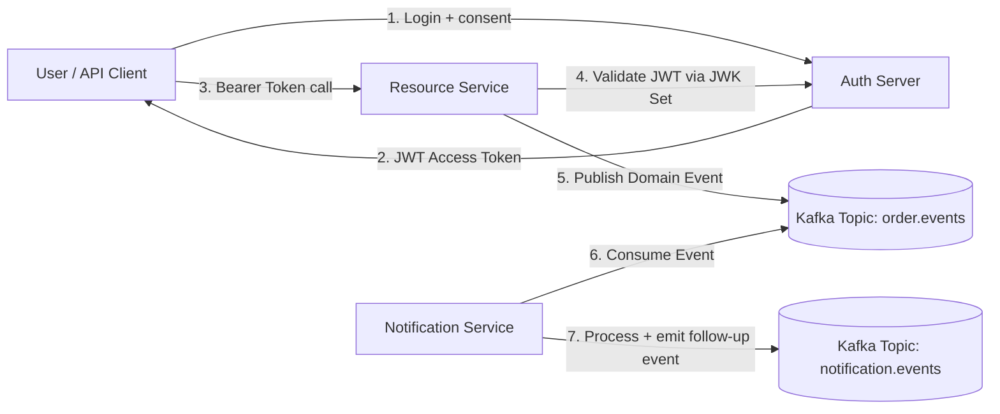

# Spring Security + Kafka Deep-Dive Lab (3 Applications)

This repository contains **three Spring Boot applications** designed to help you learn, practice, and remember:

- Spring Security basics and RBAC
- JWT authentication
- OAuth2 flows (Authorization Code + Client Credentials)
- Kafka event-driven patterns with secure, role-aware interactions

## Applications

1. **auth-server** (`apps/auth-server`)
   - OAuth2 Authorization Server
   - Issues JWT tokens
   - Stores users + roles in-memory for learning

2. **resource-service** (`apps/resource-service`)
   - OAuth2 Resource Server
   - Validates JWT from auth-server
   - Exposes role-based APIs (`USER`, `ADMIN`)
   - Publishes business events to Kafka

3. **notification-service** (`apps/notification-service`)
   - Kafka consumer + producer
   - Consumes business events
   - Applies scenario-driven handling (retry/dead-letter conceptual hooks)

---

## High-Level Learning Flow



---

## Scenario Map (What to Practice)

### Scenario A: Role-Based API Access
- `USER` can create/view own orders.
- `ADMIN` can approve/reject orders and view all.

### Scenario B: OAuth2 Authorization Code
- Use browser-based flow to obtain token.
- Call secure resource endpoint.

### Scenario C: Client Credentials for Service-to-Service
- A machine client gets token and invokes an admin automation endpoint.

### Scenario D: Event-Driven Async Workflow
- Resource service publishes `OrderCreatedEvent`.
- Notification service consumes and emits `NotificationSentEvent`.

### Scenario E: Error Handling Pattern
- Simulated failure path in notification consumer.
- Add retry strategy / dead-letter topic as exercise.

---

## Quick Start

### 1) Start Kafka
You can use your local Kafka cluster or Docker Compose in this repo:

```bash
docker compose up -d
```

### 2) Run the apps
Run each app in separate terminals:

```bash
cd apps/auth-server && ./mvnw spring-boot:run
cd apps/resource-service && ./mvnw spring-boot:run
cd apps/notification-service && ./mvnw spring-boot:run
```

### 3) Try endpoints
See each application's README for curl commands and OAuth2 token examples.

---

## Memory Notes (Exam/Interview style)

- **Authentication** answers: *Who are you?*
- **Authorization** answers: *What are you allowed to do?*
- **JWT** = signed token containing claims; avoid storing sensitive data in clear claims.
- **OAuth2** = delegated authorization framework; token-based access for clients.
- **Kafka** = distributed log; great for decoupling services and async workflows.
- **RBAC + Events** = secure actions trigger auditable, asynchronous processing.

> Tip: Learn each topic in layers: Security filter chain → token claims → method-level authorization → event publication/consumption.
