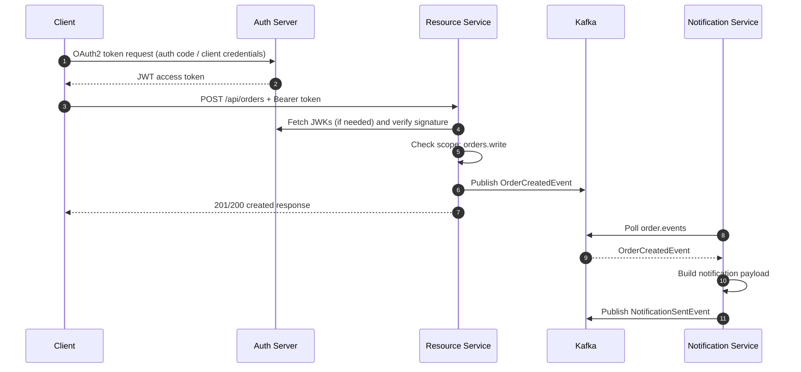

# Study Notes: Spring Security + OAuth2 + JWT + Kafka

## 1) Security Pipeline (Remember this order)
1. Client gets token from auth-server.
2. Client sends `Authorization: Bearer <token>` to resource-service.
3. Resource-service validates JWT signature via auth-server JWK set.
4. Security context is created.
5. Method-level authorization (`@PreAuthorize`) checks scopes.
6. Business logic executes.
7. Domain event is published to Kafka.
8. Notification-service consumes asynchronously.

---

## 2) Flow Chart (Detailed)



---

## 3) OAuth2 Request Samples

### Client Credentials Token
```bash
curl -u service-client:service-secret \
  -X POST http://localhost:9000/oauth2/token \
  -d 'grant_type=client_credentials&scope=orders.read orders.write orders.admin'
```

### Call protected API
```bash
curl -X POST http://localhost:8081/api/orders \
  -H "Authorization: Bearer <ACCESS_TOKEN>" \
  -H "Content-Type: application/json" \
  -d '{"item":"spring-security-book"}'
```

---

## 4) Practice Checklist
- [ ] Add issuer/audience validation in resource-service.
- [ ] Add role claim mapping (`roles` -> `ROLE_*`).
- [ ] Add dead-letter topic handling in notification-service.
- [ ] Add integration tests with Testcontainers (Kafka).
- [ ] Replace in-memory users with DB-backed users.

---

## 5) Common Interview Memory Hooks
- **OAuth2**: delegation framework.
- **JWT**: compact signed token with claims.
- **Resource server**: validates tokens, enforces API authorization.
- **Auth server**: authenticates and issues tokens.
- **Kafka**: decouples services and enables event replay.
